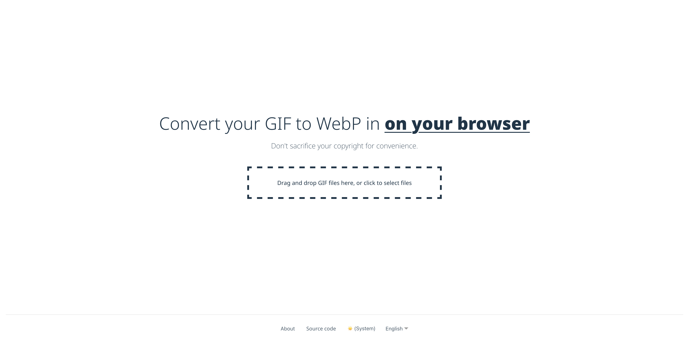

[gif2webp](https://gif2webp.vercel.app)
====================================

### gif2webp is a simple webapp to convert GIF to WebP easily in user's browser without sending file to server.



## Build

First, you have to install dependencies:

```
npm
```

Or with following options:

```
npm install 
```

Run

```
npm run dev
```
